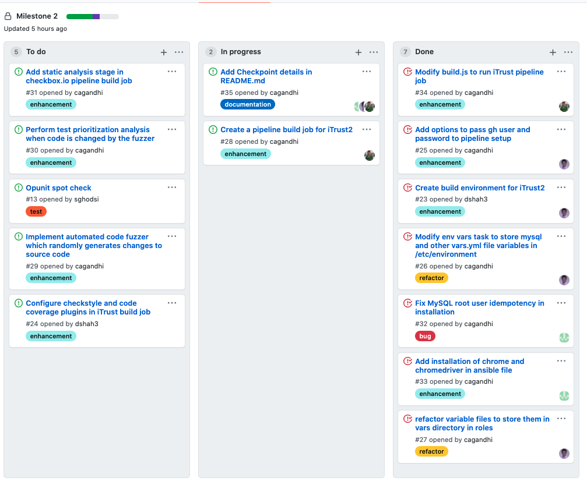
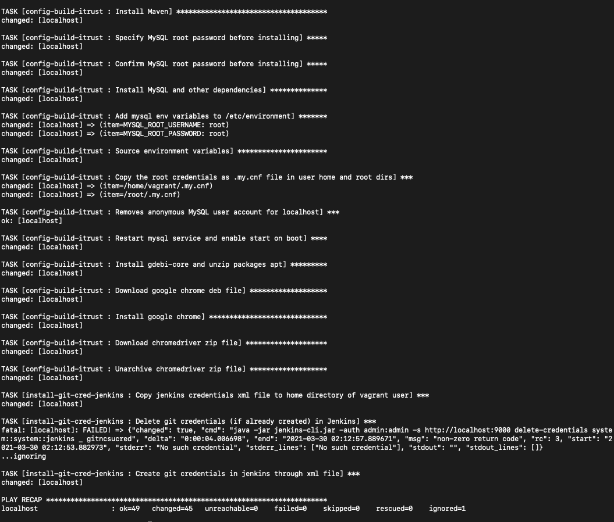

# Milestone 2 - Checkpoint

## Current Progress

### Automatically configure a build environment and iTrust build job
* Parse github user and github password (dev token) in pipeline setup and store them in Jenkins credentials manager.
* Configure build environment to run iTrust by installing Maven and configuring MySQL server.
* Install google chrome and chromedriver required to run selenium integration tests in the VM.
* Configure the iTrust pipeline build job with the clean up operations.

### Github Project Board

### Execution of pipeline setup command

## Work to be done

* Configure checkstyle and code coverage plugins in build job.
* Implement fuzzing and test suite analysis.
* Implement static analysis for checkbox.io.