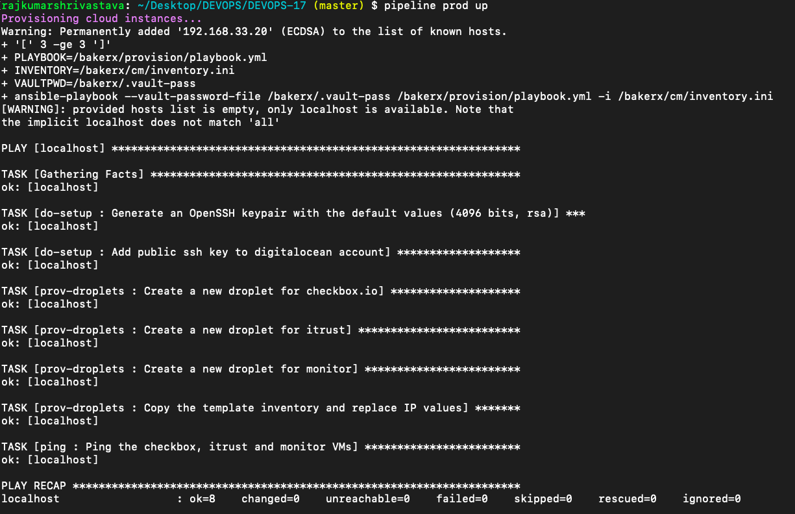
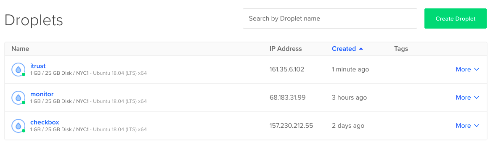
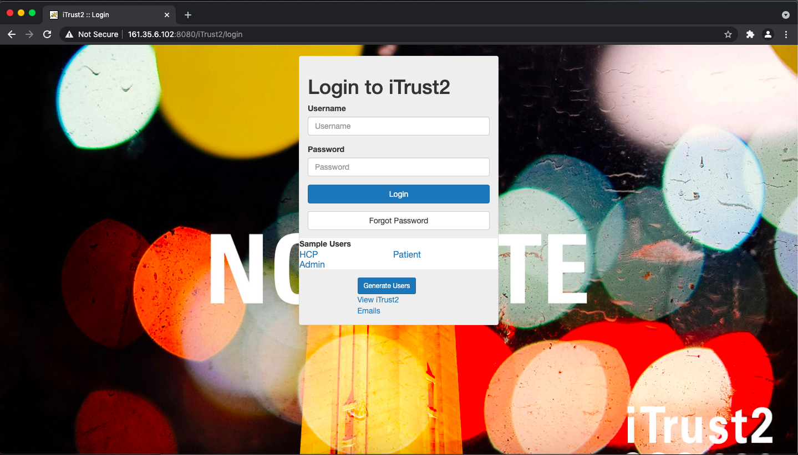
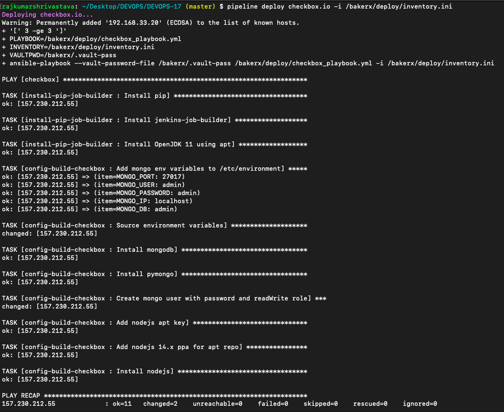
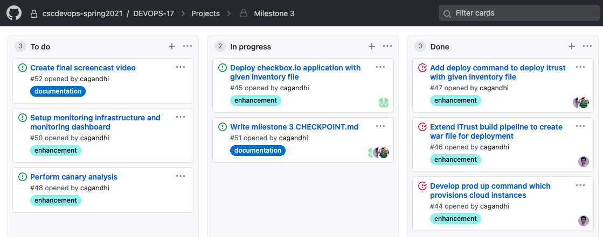

# Milestone 3 - Checkpoint

## Table of Contents

- [Current Progress](#current-progress)
  * [Provision cloud instances on DigitalOcean](#provision-cloud-instances-on-digitalocean)
  * [Deploy iTrust with given inventory file](#deploy-itrust-with-given-inventory-file)
  * [Deploy checkbox.io with given inventory file](#deploy-checkboxio-with-given-inventory-file)
  * [Github Project Board](#github-project-board)
- [Work to be done](#work-to-be-done)
- [Team contributions](#team-contributions)

## Current Progress
### Provision cloud instances on DigitalOcean

* Provisioned the required checkbox, itrust and monitor VMs on DigitalOcean. 
* Output the modified `inventory.ini` file with IP addresses for these cloud VMs.

### Deploy iTrust with given inventory file

* Installed iTrust dependencies on iTrust VM and installed Tomcat server and enabled it as service. 
* Copied the iTrust2 `war` file to the iTrust VM and restarted Tomcat. Successfully able to see the dashboard when navigating to the route `/iTrust2`.

### Deploy checkbox.io with given inventory file

* Installed the checkbox.io dependencies on DigitalOcean VM and setup the playbook for setting production environment.

### Github Project Board

## Work to be done

* Install production environment on checkbox VM and deploy checkbox.io application.
* Perform canary analysis.
* Set up monitoring dashboard.

## Team contributions

The unity ID of the member shown was responsible for the majority of the respective task.
* Provision cloud instances - `cagandhi`
* Deploy iTrust on the iTrust cloud VM - `cagandhi` and `dshah3`
* Deploy checkbox.io on checkbox VM on DigitalOcean and write checkpoint readme - `rkshriva`

All team members were equally invested in testing the configuration changes in the server on execution of ansible scripts.
