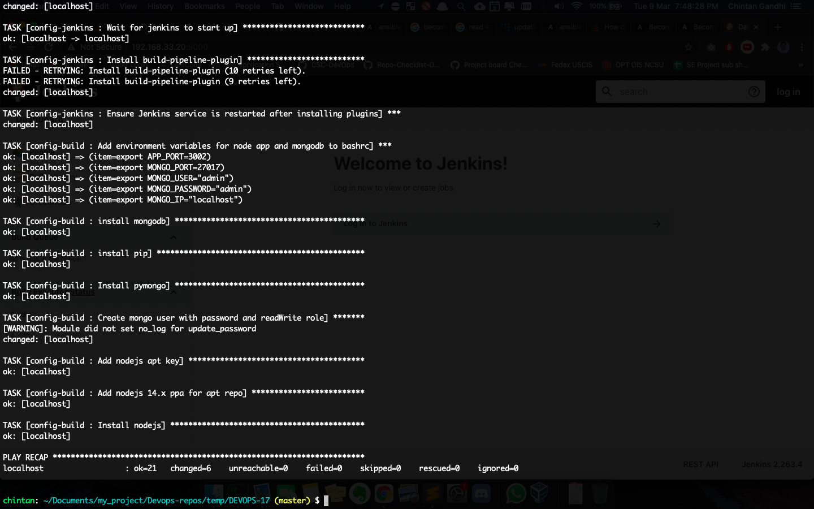

# Milestone 1 - Checkpoint

## Table of Contents

* [Current Progress](#current-progress)
    - [Step 1: Automatically configure a jenkins server](#step-1---automatically-configure-a-jenkins-server)
    - [Step 2: Automatically configure a build environment for checkbox.io](#step-2---automatically-configure-a-build-environment-for-checkboxio)
    + [Github Project Board](#github-project-board)
    + [Execution of pipeline setup command](#execution-of-pipeline-setup-command)
* [Work to be done](#work-to-be-done)
* [Team contributions](#team-contributions)

## Current Progress

* [x] Automatically configure a jenkins server. (40%)
* [x] Automatically configure a build environment. (20%)
* [ ] Create a build job. (20%)
* [x] Checkpoint report and milestone report. (10%) (Milestone report pending)
* [ ] Screencast. (10%)

#### Step 1 - Automatically configure a jenkins server
* [x] Extend CM-template code to use `pipeline setup` command. [Code Snippet](commands/setup.js#L32-L48)
* [x] Copy .vault-pass from the host to VM home directory. [Code Snippet](cm/roles/config-jenkins/tasks/main.yml#L25-L29)
* [x] Install Ansible on the config server. [Code Snippet](cm/server-init.sh)
* [x] Install Jenkins on the build server using ansible. [Code Snippet](cm/roles/install-jenkins/tasks/main.yml)
* [x] Handling authentication and disabling Jenkins setup wizard. [Groovy File](cm/roles/config-jenkins/templates/basic-security.groovy) and [Ansible Task](cm/roles/config-jenkins/tasks/main.yml#L9-L23)
* [x] Run Jenkins server on port 9000. [Code Snippet](cm/roles/config-jenkins/tasks/main.yml#L2-L7)
* [x] Install build-pipeline-plugin on Jenkins. [Code Snippet](cm/roles/config-jenkins/tasks/main.yml#L52-L62)

#### Step 2 - Automatically configure a build environment for checkbox.io
* [x] Install mongodb and nodejs. [Code Snippet](cm/roles/config-build/tasks/main.yml)
* [x] Create mongo user with password and readWrite role. [Code Snippet](cm/roles/config-build/tasks/main.yml#L28-L35)
* [x] Used Ansible Vault and stored APP_PORT=3002,MONGO_PORT=27017, MONGO_USER=\<user>, MONGO_PASSWORD=\<pass>, and MONGO_IP=localhost as environment variables. [Code Snippet](cm/roles/config-build/tasks/main.yml#L2-L6)

### Github Project Board

### Execution of pipeline setup command

## Work to be done

* Create a pipeline build job in `Jenkins` server via code and run this job.
* Document experiences and issues faced in the report and record screencast for the milestone.

## Team contributions

The unity ID of the member shown was responsible for the majority of the respective task.
* Extending the CM template, installing `Jenkins` server and configuring `Ansible Vault` - `cagandhi`
* Configuring the `Jenkins` server - `dshah3`
* Configuring the build environment for `checkbox.io` - `rkshriva`

All team members were equally invested in solving the bugs as well as testing the configuration changes in the server upon execution of the Ansible scripts.
